# Active Directory Lab Setup

## 📌 Project Overview

This project demonstrates a complete basic Active Directory Domain Services (AD DS) lab setup using Windows Server and Windows client machines.

The lab includes:

- Active Directory Domain Services (AD DS)

- DHCP Server Configuration

- Domain Join

- Active Directory User Creation

- Additional Domain Controller (ADC)

- Active Directory Replication

# 🖥️ Lab Environment

| Device | Role | IP Address |

|---|---|---|

| ROOTDC | Primary Domain Controller | Server1 | 10.0.0.1 |

| ADC | Additional Domain Controller | Server2 | 10.0.0.2 |

| PC1 | Domain Client | DHCP |

| Domain Name | AD Domain | ravikumar.online |

# ⚙️ Step 1 — Install Active Directory Domain Services

## On ROOTDC

Open:

Server Manager

### Install Roles

- Active Directory Domain Services

### Promote Server to Domain Controller

Select:

Add a new forest

### Domain Name

ravikumar.online

Set:

- DSRM Password

  
- Restart after installation

## 🌐 Step 2 — Configure Static IP Address

## ROOTDC Configuration

IP Address : 10.0.0.1

Subnet Mask: 255.0.0.0

# 💻 Step 3 — Join Client PC to Domain

## Join Domain

Open:

System Properties > Change Settings > Change

Select:

- Domain
  

Enter:

ravikumar.online

Provide domain administrator credentials.

Restart PC after successful join.

# 📡 Step 4 — Configure DHCP Server

## Install DHCP Role

Open:

Add Roles and Features

Install:

- DHCP Server

## Create DHCP Scope

Start IP   : 10.0.0.150

End IP     : 10.0.0.165

Subnet     : 255.0.0.0

Domain Name: ravikumar.online

Authorize DHCP after installation.

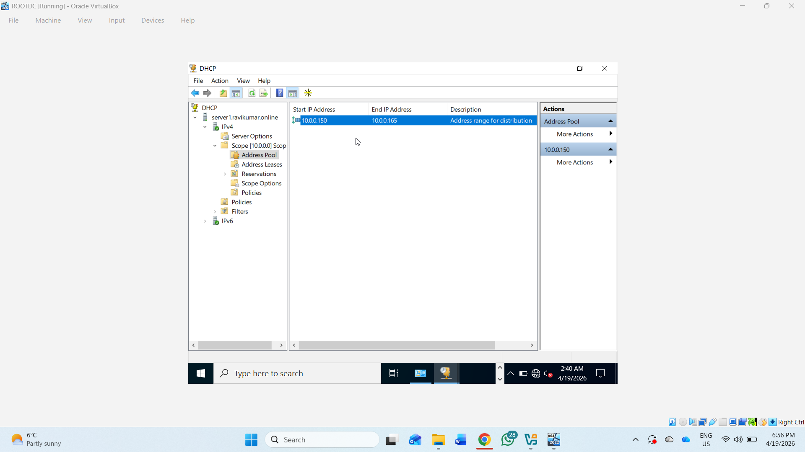

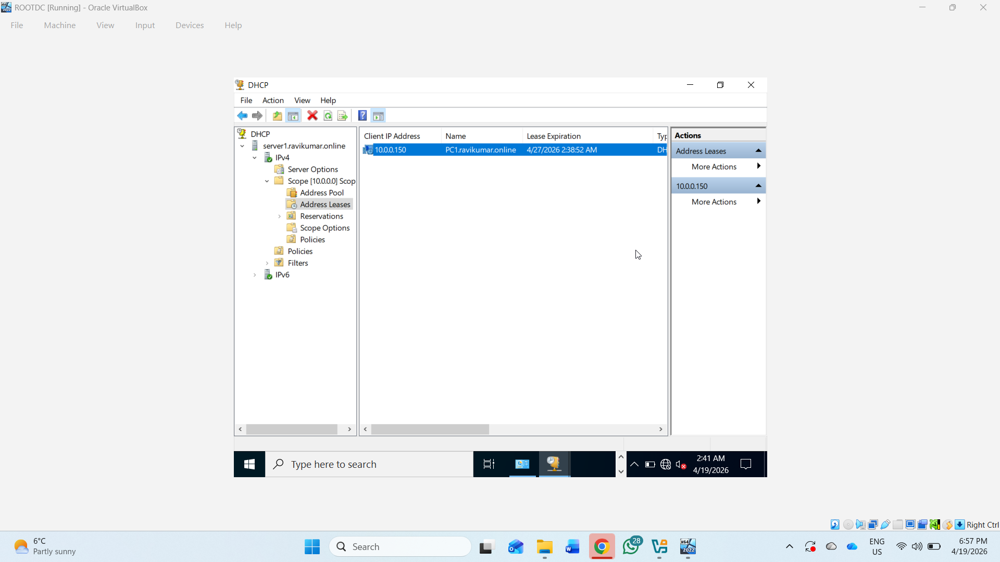

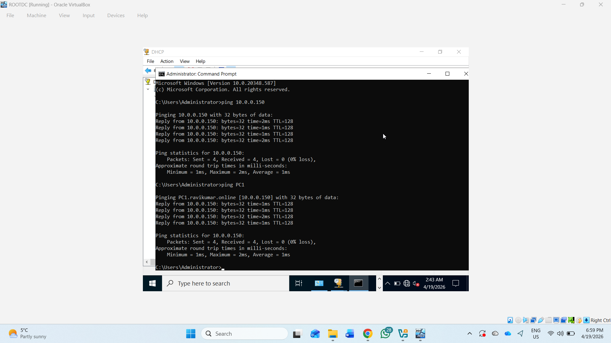

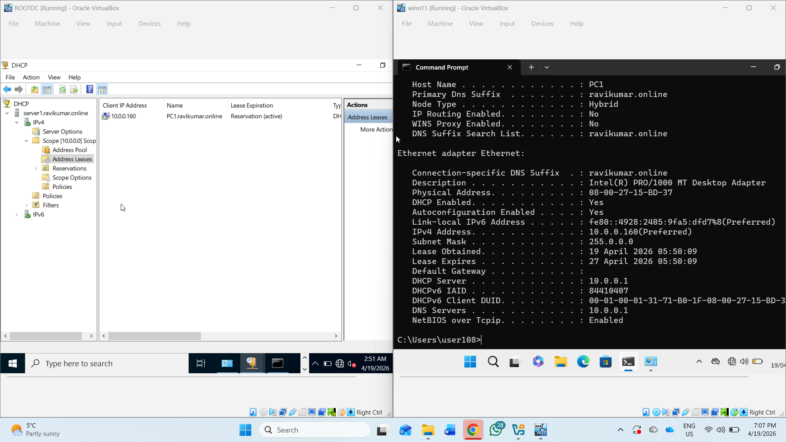

# 👥 Step 5 — Create Active Directory Users

Open:

Server Manager > Tools > Active Directory Users and Computers

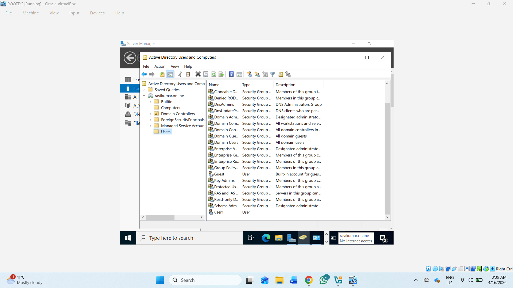

# 🏢 Step 6 — Create Additional Domain Controller (ADC)

## Configure ADC Static IP

IP Address : 10.0.0.2

Subnet Mask: 255.0.0.0

## Join ADC to Domain

ravikumar.online

Restart the server.

# 🔄 Step 7 — Promote ADC to Domain Controller

Install:

- Active Directory Domain Services

Select:

Add a domain controller to an existing domain

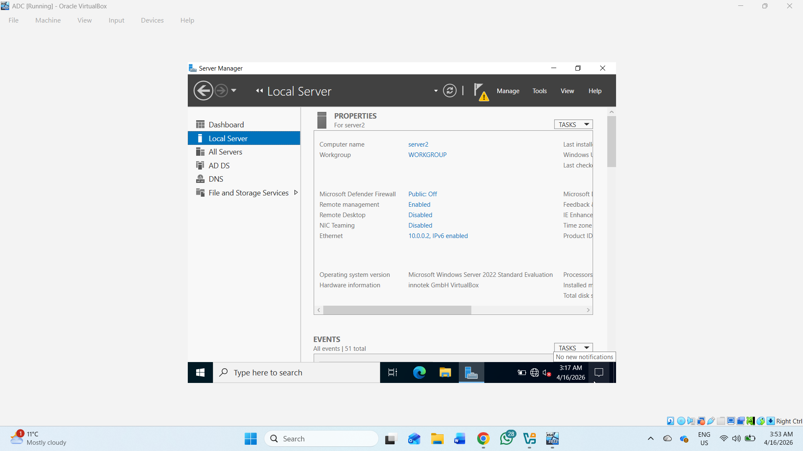

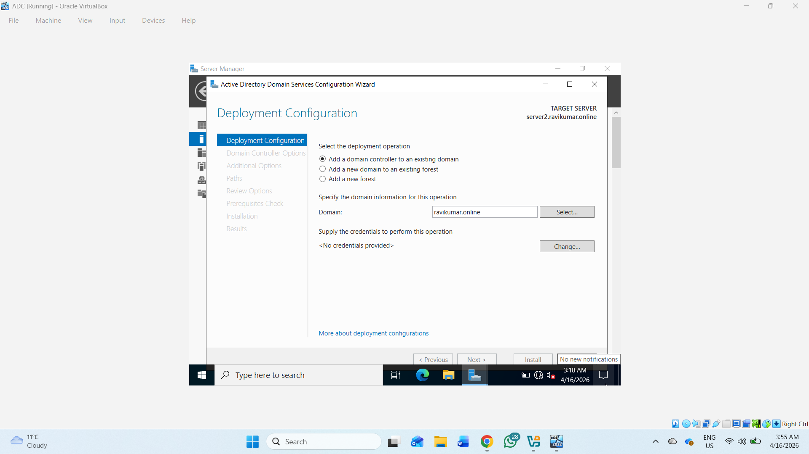

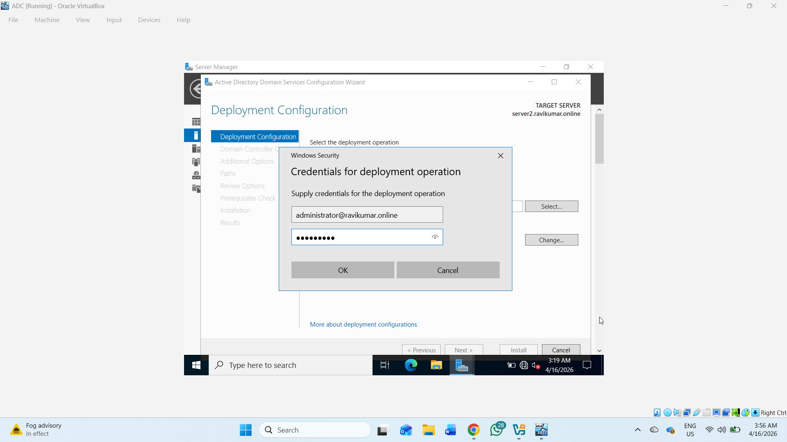

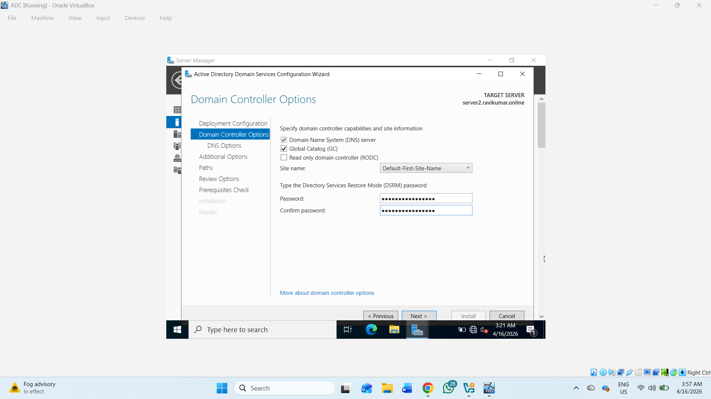

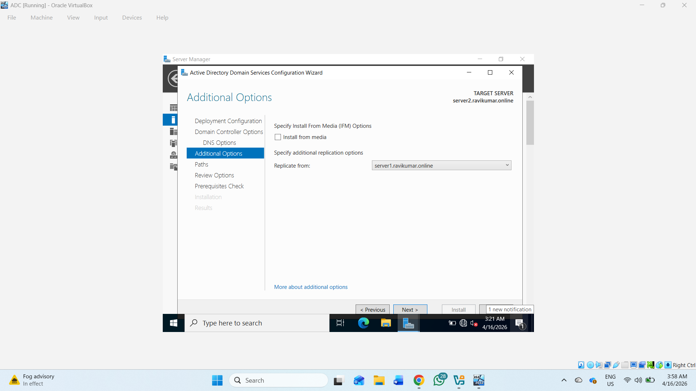

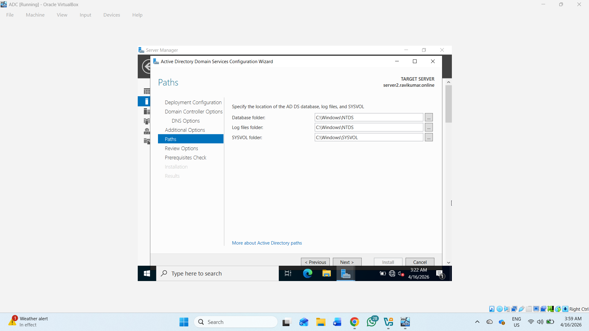

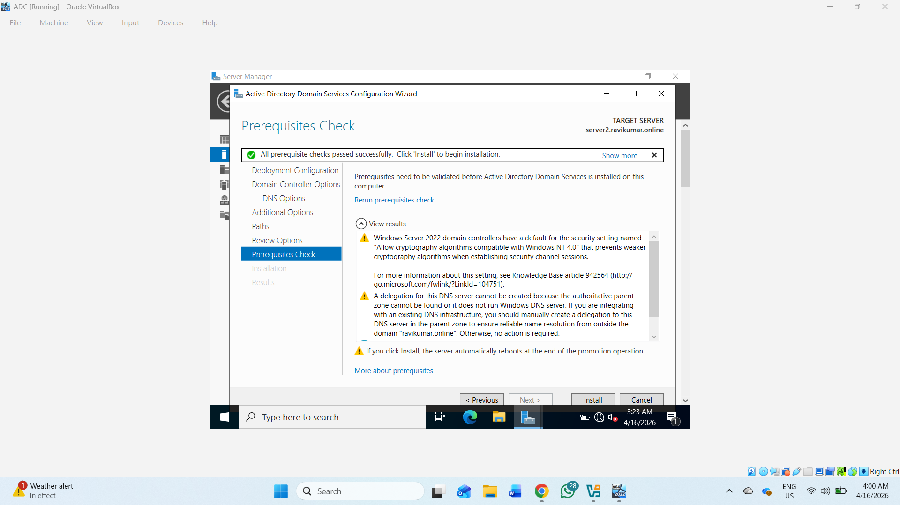

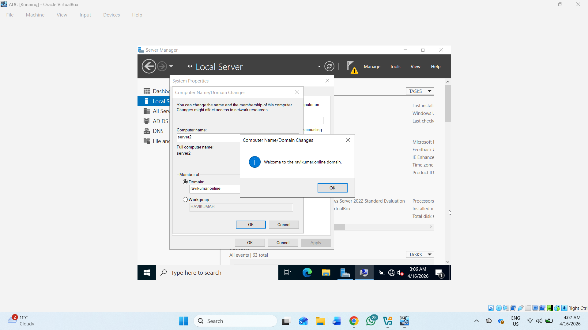

Domain:

ravikumar.online

Enable:

- DNS Server

  
- Global Catalog (GC)

Restart after promotion.

# ✅ Step 8 — Verify Replication

## Check Replication Summary

repadmin /replsummary

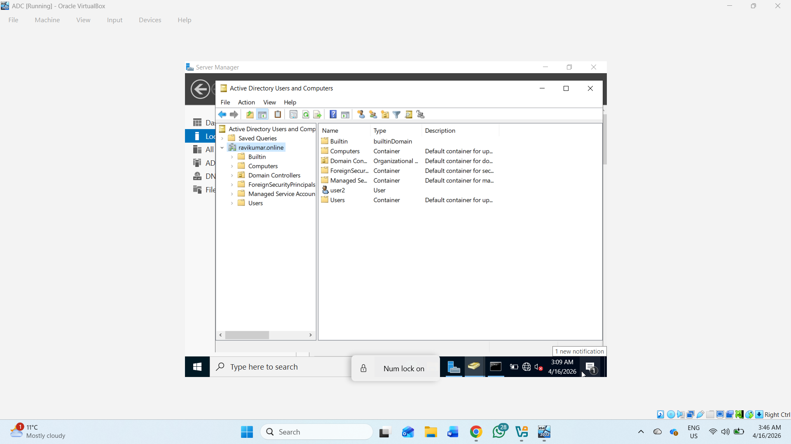

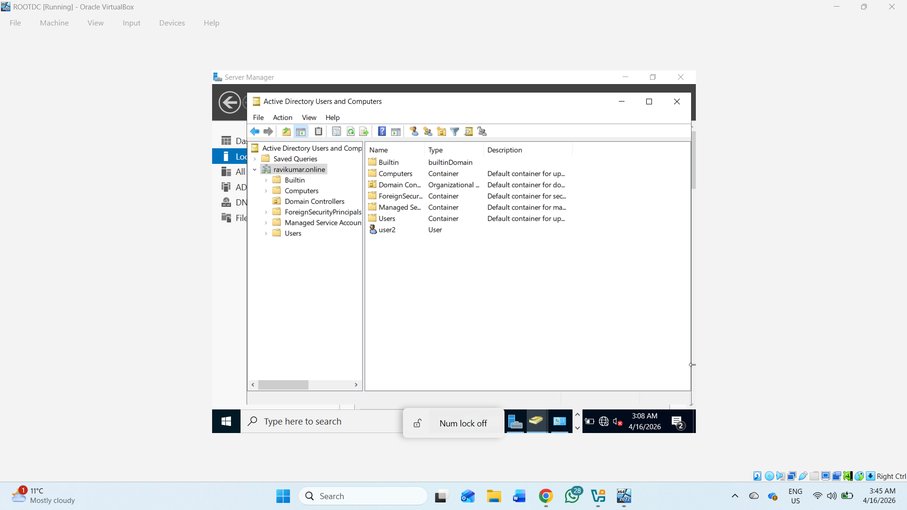

## Force Replication

repadmin /syncall /AdeP

## Verify Domain Controllers

Get-ADDomainController -Filter *

Expected:

- ROOTDC

- ADC
 

# 🛠️ Useful Commands

## Check IP Configuration

ipconfig /all

## Verify DNS

nslookup ravikumar.online

## Test Connectivity

ping 10.0.0.160

## Force Group Policy Update

gpupdate /force

# 📚 Features Implemented

- Active Directory Domain Services
- DNS Server
- DHCP Server
- Domain Join
- Active Directory Users
- Additional Domain Controller
- Active Directory Replication
- Centralized Authentication

# 📖 Technologies Used

- Windows Server
- Active Directory
- DHCP
- PowerShell
- VirtualBox
  

# 👨‍💻 Author

Ravi Kumar

Windows Server & Active Directory Lab Project
